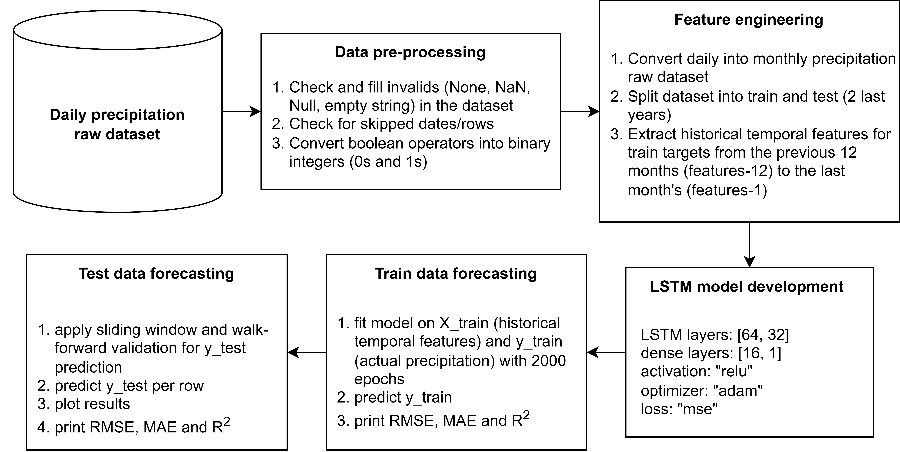

# Monthly-precipitation-LSTM-forecasting
An LSTM implementation for monthly precipitation forecasting using Kaggle dataset: https://www.kaggle.com/datasets/rtatman/did-it-rain-in-seattle-19482017

## 🔍 Overview

The system operates by:

1. **Connecting to a seismic mseed folder** using obspy.clients.filesystem.sds.  
2. **Excluding earthquake-contaminated data** using ObsPy's recursive STA-LTA.  
3. **Extracting Power Spectral Density (PSD) features** using PPSD from ObsPy at selected four periods ranges: 4-8s, 18-22s, 90-110s, and 200-500s.  
4. **Detecting anomalous seismometer data** using a One-class SVM (1-SVM) model.   
5. **Saving results** into a dataframe and converting it into an xlsx file.
